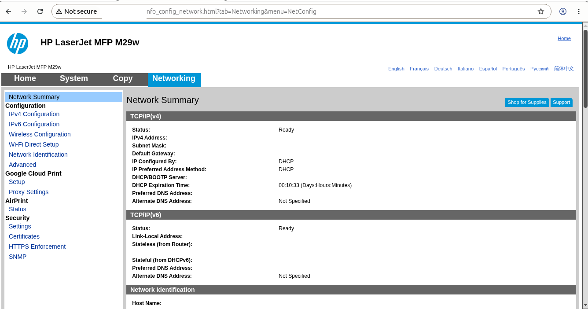
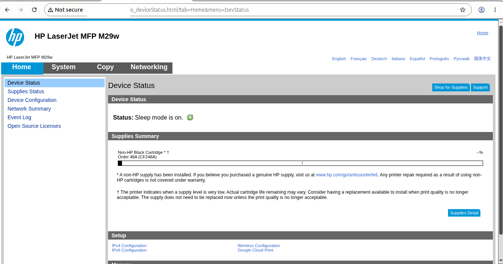
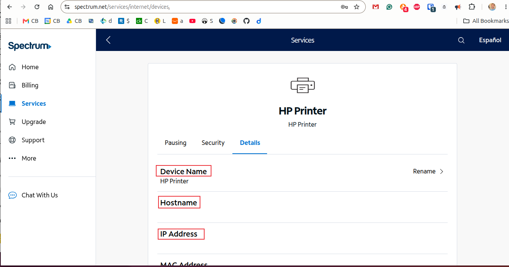

**HP Printer Network Troubleshooting**

I documented the troubleshooting process that I used to reconnect an HP LaserJet M29w printer after moving residences with my wife. This project demonstrates printer network troubleshooting, wireless reconfiguration, device validation, and packet capture analysis using `tshark`.

Lab Objectives
- Restore printer connectivity to a wireless network
- Verify printer network configuration
- Confirm printer visibility on the local network
- Access and review the printer web interface
- Use a packet capture analysis tool to test and validate network communication
- Document the troubleshooting process and resolution

Environment
- Ubuntu Linux Desktop
- HP LaserJet M29w
- Spectrum Router
- Google Chrome
- `tshark`

Problem

After moving to a new residence, my printer/scanner was no longer connected to the wireless network. As a result, I was unable to print, nor access the printer's management interface.

Troubleshooting Process

Printer Network Validation

During troubleshooting, I pressed and held the printer's information button for approximately three seconds. This printed a Configuration Report and Network Summary page containing the printer's current network settings.

I reviewed the printed Network Summary and identified the printer's Wi-Fi Direct configuration. The report displayed the Wi-Fi Direct SSID and password, which allowed me to establish a direct wireless connection between my workstation and the printer.

Using the Wi-Fi Direct information provided on the report, I connected directly to the printer's wireless network. After successfully connecting, I opened a web browser and navigated to the printer's embedded web interface using the address provided on the Network Summary page.

This allowed me to access the printer's management interface and review its network configuration. From the web interface, I verified the printer's current status and configured the printer to connect to my home wireless network.

After the printer joined the wireless network, I reviewed the network settings in the embedded web interface and confirmed that the device obtained a valid IP address via DHCP. The printer was assigned the IP address and displayed the expected network configuration information.

This process confirmed that the printer had successfully connected to the wireless network and could communicate with other devices on the local network.

Printer Web Interface Verification

I opened the printer's web management interface to check its operational status and confirm it could be managed across the network.

This provided confirmation that network communication between the workstation and printer was functioning correctly.

Router Device Verification

I reviewed the Spectrum router management portal and confirmed that the printer appeared as an active connected device.

This verified that the printer was successfully joined to the wireless network and visible to other devices on the local network.

Packet Capture Analysis with `tshark`

I used `tshark` to capture network traffic between my Ubuntu laptop and the printer.

The packet capture confirmed:
- TCP three-way handshake activity
- HTTP GET requests from the workstation
- HTTP 200 OK responses from the printer
- Successful communication between both devices

This provided packet-level validation that I successfully added my printer to the wireless network and that the printer services were functioning correctly.

The above image shows that my Ubuntu workstation initiated a TCP connection request to my printer's web server on TCP port 80. It shows that the printer acknowledged the connection request and demonstrated that it was ready to establish a TCP session. My Ubuntu workstation completed the TCP three-way handshake; this established a reliable communication session.

The packet capture showed HTTP GET requests from my web browser and HTTP 200 OK responses from the printer's embedded web server. This confirmed that communication between the applications was functioning correctly after the printer was reconnected to the wireless network.

Google Chrome generated HTTP GET requests to the printer's embedded web interface, and the printer responded with HTTP 200 OK messages indicating successful delivery of the requested resources.

Skills Practiced
- Network Troubleshooting
- Wireless Device Configuration
- DHCP Validation
- Administration of Embedded Web Interface
- TCP/IP
- PCAP (Packet Capture) Analysis
- `tshark`
- HTTP Communication Analysis
- Technical Documentation

Key Networking Concepts Observed

TCP Three-Way Handshake

The packet capture showed the standard TCP connection process:
SYN
SYN-ACK
ACK

This sequence established a reliable connection between my daily driver and the printer before data transfer occurred.

HTTP Communication

The capture also showed HTTP GET requests and HTTP 200 OK responses.

This confirmed that my Ubuntu laptop successfully requested information from the printer web interface and that the printer returned the requested content.

DHCP Network Assignment

The printer received its network configuration automatically through DHCP. This allowed my printer/scanner to join the wireless network without manual IP configuration.

Lessons Learned:
- Network configuration reports can be critical in printer troubleshooting; they provide the information needed to discover the printer on the wireless network.
- Embedded web interfaces are useful because they can quickly validate the connectivity status of the printer.
- Router management portals (that is, the Spectrum portal in this case) can help verify the presence of a particular device on the network.
- Packet captures provide evidence of successful communication at the protocol level.
- 'tshark' is an effective command-line tool for network troubleshooting and analysis.

Summary

This project demonstrates practical printer troubleshooting and network validation in my home network. It shows how wireless configuration, device management, router verification, and packet capture analysis can be combined to diagnose and validate network-connected devices.

[`Back to GitHub Profile`](https://www.github.com/cbueker-it)
